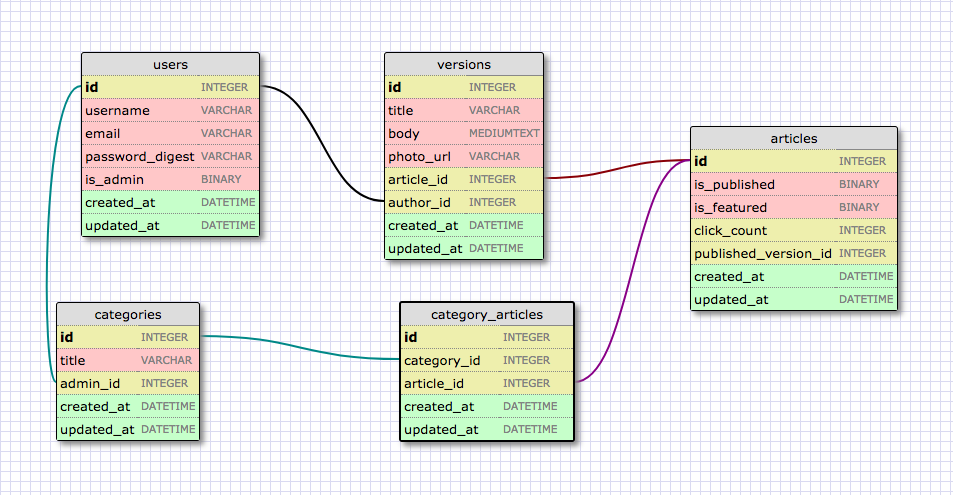

# Fillypedia

Fillypedia is a wiki all about horses. :)

## Built With

* [Ruby on Rails](http://guides.rubyonrails.org/)
* [PostgreSQL](https://www.postgresql.org/) - Database
* [Paperclip](https://github.com/thoughtbot/paperclip) - Image attachment
* [CKEditor](https://github.com/ckeditor) - Text Editor

## Authors

* **Baska Batbold**  - [itsbaska](https://github.com/itsbaska)
* **Victoria Luc**  - [victoriajeniluc](https://github.com/victoriajeniluc)
* **Charlie Weber**  - [cweber648](https://github.com/cweber648)
* **Matthew Black**  - [matthew-black](https://github.com/matthew-black)
* **Patrick Rodriguez**  - [patrodriguez108](https://github.com/patrodriguez108)

### Schema

### User Stories

Different user types
* guest: can read articles
* member: can read and write articles; can edit and delete their own published articles
* admin: can read, write, edit, and delete all articles

A user can write articles
* drafts: user can write article without publishing; the draft will be saved; a user can revert to previous draft
* publish: user can publish article to be read publicly

A user can edit an article
* member can edit their own article only
* admin can edit all articles

A user can see all versions of their article
* members and admin only
* user can publish past version or new version

A user can search for articles

Admin can determine featured articles

Admin can make new categories

When writing or editing an article, the user can
* access a built-in text editor
* upload images
* provide links to other articles and external sources (e.g. social media)

## License

This project is licensed under the MIT License

## Acknowledgments

* Thank you to [Graham](https://github.com/telegraham) for their help and guidance.
